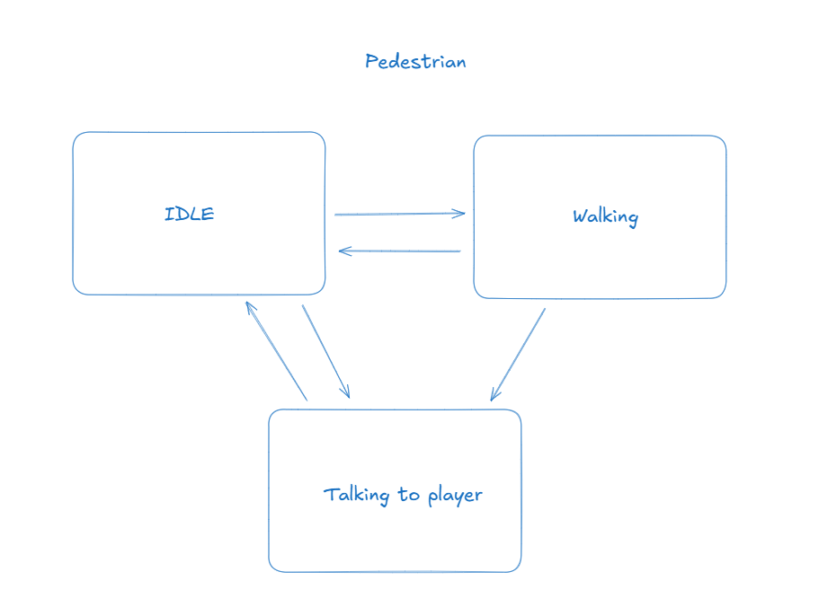
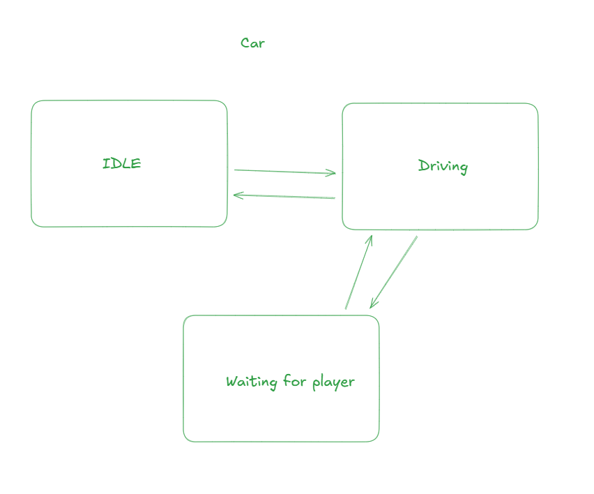
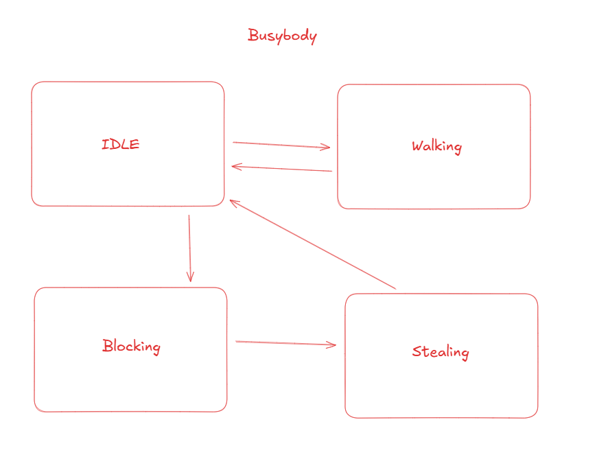

# Crash Scene Investigator

## Brief overview
Crash Scene Investigator is a game made to educate youth about Road Safety. Investigate crash sites and figure out the culprit, their wrongdoings and convict them!
### Controls
WASD - Movement 
Space - Jump 
E - Interact 
Tab - Open Case File menu 
Esc - Pause  

## Intended platform and hardware
Platform: Windows 
Hardware Specifications: FHD display (1920x1080) 

## Known bugs and limitations
- Final screen showing the wait for game updates screen cannot be interacted with
- If hovering over evidence while transitioning scenes, it will stay in the UI indefinitely
- If interacting with the big boss multiple times after returning to the office, the final results screen will bug out
- Currently only 2 playable levels

## Finite State Machines
### Pedestrian FSM
The pedestrian FSM makes use of the NavMesh Agent component to navigate throughout the scene, following the Humanoid Navmesh and navigates only on sidewalks and crossings. It is put forcibly into Idle when waiting at traffic lights and talks to the player when interacted with 

### Car FSM
The Car FSM makes use of the NavMesh Agent component to navigate throughout the scene, following the Car Navmesh and navigates only on roads. It is put forcibly into Idle when waiting at traffic lights and stops to honk at player 

### Busybody FSM
The busybody NPC is the only enemy of the game, he acts the same as the pedestrian, but after a while will transition to blocking the player from picking up evidence. After a while more, he picks up the evidence himself and will go back to walking, and the player must retrieve it from the busybody. 

## External References
### Models
Trees: [Stylized Tree & Grass Samples(Symphonie Studio): Unity Assets Store](https://assetstore.unity.com/packages/3d/vegetation/trees/stylized-tree-grass-samples-304714) 
### Textures
Stylized Nature Textures: [Stylized Nature Textures(Yoge): Unity Assets Store](https://assetstore.unity.com/packages/2d/textures-materials/stylized-nature-textures-228680) 
### Code
Player Controller: [Starter Assets : Unity Assets Store](https://assetstore.unity.com/packages/essentials/starter-assets-character-controllers-urp-267961?srsltid=AfmBOopwNbftk8lbgmCCX9WvvS_A8_Uv_wj1qGvzOyF7IJB54vSBqTKp) 
Item Outlines: [Quick Outlines (Chris Nolet): Unity Assets Store](https://assetstore.unity.com/packages/tools/particles-effects/quick-outline-115488?aid=1101l9Bhe ) 
### Sounds
Collecting Objectives: [Item pickup](https://pixabay.com/sound-effects/item-pickup-37089/) 
Player Win Sound: [You win sequence 1](https://pixabay.com/sound-effects/you-win-sequence-1-183948/) 

## Game flow/Tutorial
Day 1
Evidences: 
- Headphones next to the victim
- Handphone next to the victim
- Talk to Andy nearby (Closest NPC that does not move)

Answers:
- Pedestrian Fault: Crossing while not focused
- Person at fault: Pedestrian

Day 2
Evidences:  
- Speed camera on the left
- Dashcam dropped in front of the car
- Talk to Sarah nearby (Closest NPC that does not move)

Answers:
- Driver Fault: Speeding through a red light
- Person at fault: Purple car

Rank requirements: 
F - Both Fault and Culprit wrongly identified  
C - Only one Fault or Culprit correctly identified  
B - Both the Fault and Culprit are correctly identified but 2 or less clues found 
A - Previous requirement and all clues found 
S - Previous requirements, but with more than 90s left 

# Please Enjoy :D
